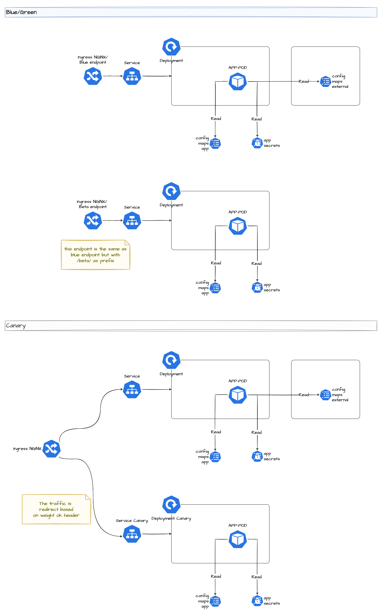

# Architecture

## Main Arch


## Canary Arch



## Helm/Kubernetes Objects

### Deployment Main

#### PODs

The deployment contains one pod:

1. **app pod**: dedicated to app

#### Secrets

The deployment use `SecretProviderClass` (connected to azure via SecretStoreCSIPRovider) to load secrets.
In this case the secrets are loaded from the KV, and converted to secret and ENVIRONMENT variables that are used by the pods

```yaml
  envSecret:
    aks-api-url: cstar-d-weu-dev01-aks-apiserver-url

```

#### Config Maps

There are two types of config maps:

1. Deployment config maps: the config maps are created automatically from the values definied inside the helm template, and the name of the config maps is the same as the project

```yaml
  envConfig:
    APP: foo
```

1. You can refence external config maps usign this values:

```yaml
  envConfigMapExternals:
    progressive-delivery-mock-one:
      PLAYER_INITIAL_LIVES_ENV: player_initial_lives
      UI_PROPERTIES_FILE_NAME_ENV: ui_properties_file_name
```

Where:

- the key of the map is the external config map
  - the key, value is: key -> the ENV name inside the deployment, value -> the key inside the config map

## Secret provider class

The secret provider class allows to define:

- which key vault to use
- which kind of secret or certificate to load
- setup azure information to contact the key vault

All the operations are done via the Managed Pod Identity that allows the connection

### Documentation

<https://secrets-store-csi-driver.sigs.k8s.io/concepts.html#secretproviderclass>
<https://secrets-store-csi-driver.sigs.k8s.io/concepts.html>

## Service

Service as usual

## NGNIX Ingress

The ngnix ingress allow to configure a host (with the tls certificate that must be present into the kv) and the path to use for that ingress.

Multiple ingress can be created with the same host but mandatory with different paths

## Keda scale object

With Keda is possibile to autoscale the pods (keda wraps the HPA) and allow us to choose more business metrics like: request, status from objecs, ecc.. and not only cpu and ram.

With Keda and the defined Managed pod identity is possible to connect to logs analytics to load data directly from azure. And avoid to create a prometheus.

## Canary

### Deployment

Is a copy of deployment template, but allow to setup the same application with different version and configuration

### Secrets & config maps

Allow to have different config maps and secret to be able to change configuration and test new configurations

## Network canary

### Ingress canary

Same ingress as default, but with the option `canary` that allows to configure the behavior of the application

### Service canary

Same as default service but dedicated to `canary application`
